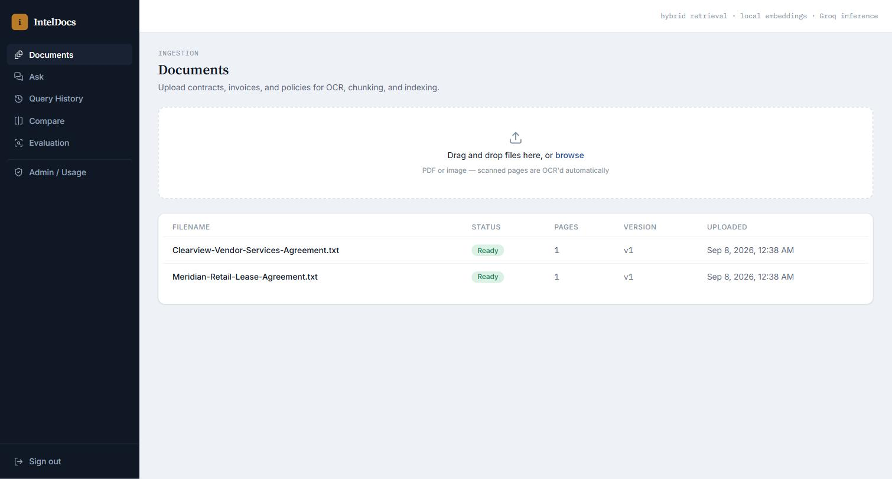
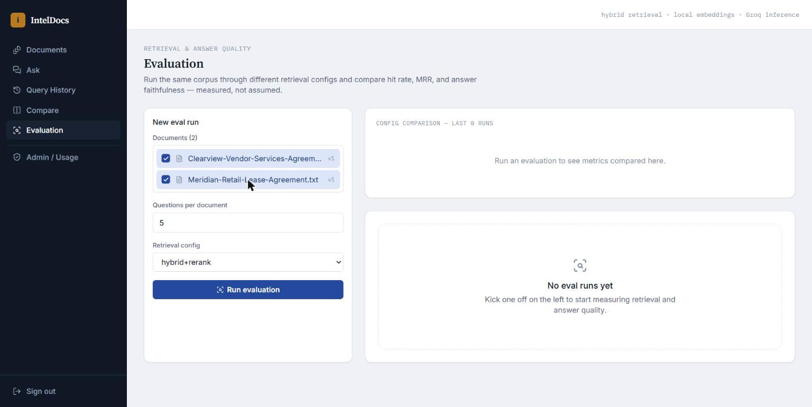
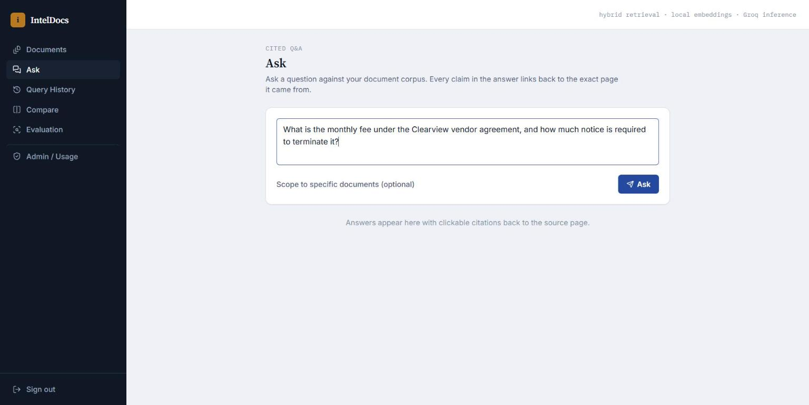
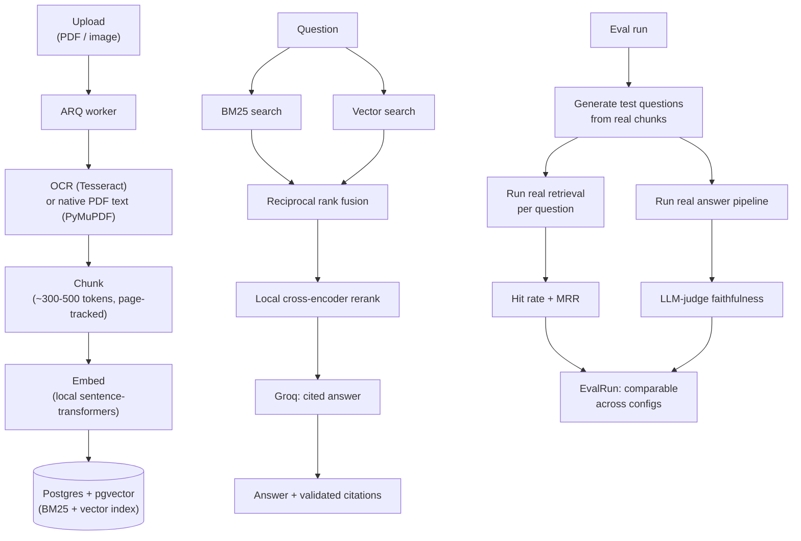

# IntelDocs

A document intelligence platform: upload contracts, invoices, or policies (scanned or native PDFs), get hybrid-search-backed answers with citations back to the exact page, compare documents, flag risky clauses — and, distinctively, **measure whether the retrieval and answers are actually correct** with a real evaluation pipeline rather than just trusting the demo.

This exists to demonstrate serious LLM/RAG infrastructure, not another "chat with your PDF" wrapper. The evaluation pipeline is the point: it auto-generates test questions from real ingested documents, runs them through the actual retrieval and answer pipeline, and reports real hit-rate/MRR/faithfulness numbers you can compare across retrieval configurations.

## Screenshots


*Ingestion pipeline: uploaded documents move from processing to ready with real page counts, versioning, and status tracking.*


*The differentiator: configuring an evaluation run against real ingested documents, choosing the retrieval strategy to test (vector-only, hybrid, or hybrid+rerank). Captured mid-setup rather than with a completed run — this environment doesn't have a live Groq key wired in, so the actual hit-rate/MRR/faithfulness numbers weren't exercised for this capture.*


*Cited Q&A: asking a question scoped to the ingested document corpus, with answers designed to link back to the source page.*

## Problem

Most "RAG chatbot" demos never answer the question that actually matters to a technical buyer: *how do you know it's retrieving the right thing and not hallucinating?* Teams building document Q&A systems typically ship on vibes — a few manual spot-checks — because building a real evaluation harness is more work than the RAG pipeline itself.

## Solution

IntelDocs ingests documents through OCR/text extraction, chunks and indexes them with both BM25 and vector search fused together, reranks with a cross-encoder, and answers questions with citations that trace back to a specific chunk and page. Then, instead of stopping there, it includes a genuine evaluation pipeline: pick a document set, generate test questions from real chunks, run them through retrieval and answer generation, and get back measured hit rate, mean reciprocal rank, and LLM-judged answer faithfulness — comparable across different retrieval configurations (vector-only vs. hybrid vs. hybrid+rerank).

## Features

- **Ingestion** — PDF/image upload, OCR via Tesseract for scanned pages, native text extraction (PyMuPDF) where OCR isn't needed, processed asynchronously (ARQ + Redis) so upload returns immediately while a worker chunks, embeds, and indexes in the background.
- **Hybrid retrieval** — BM25 (Postgres full-text search) and pgvector cosine similarity combined via reciprocal rank fusion, not just one or the other.
- **Local reranking** — a cross-encoder (`cross-encoder/ms-marco-MiniLM-L-6-v2`, runs locally, no API) narrows the fused candidates before they reach the LLM.
- **Cited Q&A** — answers reference specific chunks/pages; citations are validated against what was actually retrieved, not trusted blindly from the LLM's output.
- **Evaluation pipeline** — generates test questions from real chunks, runs the real retrieval+answer pipeline against them, computes hit rate and MRR for retrieval quality and an LLM-judged faithfulness verdict (`faithful`/`unfaithful`/`partial`) for answer quality, and stores results per run so different retrieval configs can be compared side by side.
- **Document versioning** — reuploading a document links it to its prior version via `parent_document_id`.
- **Summarization & clause/risk flagging** — per-document summary plus extracted clauses with a risk level.
- **Document comparison** — structured diff across two or more documents.
- **Multi-tenant auth** — Organization → Users, JWT-based, admin/member roles.
- **Admin usage tracking** — documents processed, queries run, token usage, by day.

## Architecture



## Technology Stack

**Backend**
- FastAPI, SQLAlchemy + Alembic, PostgreSQL with the `pgvector` extension (required — no SQLite fallback, unlike this developer's other projects, since vector search needs it)
- Redis + ARQ for async document processing and evaluation runs
- `sentence-transformers` (embeddings: `all-MiniLM-L6-v2`; reranking: a local cross-encoder) — no paid embedding API
- Tesseract (`pytesseract`) for OCR, `PyMuPDF` for native PDF text extraction
- Groq for LLM calls — **note**: `llama-3.3-70b-versatile` has been decommissioned by Groq (verified live, 404); this project uses `openai/gpt-oss-120b`, Groq's current free-tier flagship open-weights model
- JWT auth (PyJWT + passlib/bcrypt)

**Frontend**
- React + TypeScript + Vite, Tailwind CSS, TanStack Query
- Pages: Documents, Ask (cited Q&A), Query History, Compare, Evaluation (with cross-run config comparison), Admin Usage

**Infra**
- Docker Compose: API + PostgreSQL (pgvector) + Redis + ARQ worker — verified working end-to-end
- GitHub Actions CI for backend (lint + pytest) and frontend (lint + typecheck + test + build)

## Environment Variables

Copy `backend/.env.example` to `backend/.env`. Key vars: `DATABASE_URL`, `REDIS_URL`, `SECRET_KEY`, `GROQ_API_KEY` (leave blank to run ingestion/retrieval with LLM-dependent endpoints returning a clear 503 rather than crashing), `GROQ_MODEL`, `EMBEDDING_MODEL`, `RERANKER_MODEL`, `TESSERACT_CMD`. Frontend: copy `frontend/.env.example`, set `VITE_API_BASE_URL`.

## Local Development

```bash
docker compose up
```
Runs Postgres (with pgvector), Redis, the API (migrations applied automatically), and the ARQ worker together.

Or run pieces individually — see `backend/.env.example` and `frontend/.env.example` for the FastAPI/`uvicorn app.main:app` and `npm run dev` setup respectively.

## Testing

- **Backend**: pytest — unit tests for chunking (bounds, page-spanning, overlap, sequential indexing) and for the reciprocal-rank-fusion scoring logic (the core of hybrid retrieval).
- **Frontend**: Vitest/React Testing Library — citation rendering/linking, status-badge and eval-metric formatting logic, component tests for citation display.

## Verification Notes (what was actually confirmed working, not just written)

- Full stack brought up via `docker compose up` against real containerized Postgres+pgvector and Redis.
- Real document upload → async worker processing → status transitions from `processing` to `ready` with correct page count, confirmed against the running API.
- Multi-tenant isolation confirmed: two separately registered organizations correctly see only their own documents.
- Frontend confirmed rendering real backend data (document list, status, versioning) through the actual API, not mocked.
- Two real bugs found and fixed during this verification: a missing `email-validator` dependency (Pydantic's `EmailStr` needs it, wasn't pinned) that crashed the API on startup, and missing CORS middleware that silently blocked every frontend-to-API request.
- One chunking bug found and fixed: the orphan-tail-merge logic could produce chunks that exceeded `max_tokens` — now only merges when the result stays within bounds.
- LLM-dependent endpoints (cited Q&A, evaluation runs, summarization, comparison) were confirmed to fail gracefully (503, clear message) without a `GROQ_API_KEY`, matching the required demo-mode behavior — full end-to-end verification of those paths needs a live Groq key, which wasn't exercised in this pass.

## Engineering Challenges

- **Keeping citations honest.** An LLM asked to cite sources will sometimes cite something plausible-sounding rather than something it was actually given. Citations are validated against the chunk IDs actually passed as context, not trusted from the model's output alone.
- **Making the evaluation pipeline measure something real.** It would be easy to fake this — hardcode a score, or generate trivial questions that any retrieval system would ace. The design generates questions from actual ingested chunks (so there's a real ground truth) and runs the *actual* retrieval and answer code paths, not a simulated version, so the numbers reflect the real system's behavior, including its failure modes.
- **No paid embedding/reranking APIs.** Running embeddings and cross-encoder reranking locally (via `sentence-transformers`) instead of a hosted API keeps the whole ingestion and retrieval path free to run, at the cost of needing `torch` in the deployment image — a real tradeoff between cost and image size/startup time.

## Limitations / Future Improvements

- No SQLite fallback (pgvector is a hard requirement) — heavier local setup than this developer's other projects, by design.
- Document processing is async but single-worker in the default Compose setup — would need worker scaling for real throughput.
- Rate limiting isn't implemented on ingestion or query endpoints yet.
- The eval pipeline's question generation samples a bounded number of chunks per document rather than exhaustively covering a corpus — appropriate for a demo/portfolio scale, would need tuning for a large real corpus.

## Freelance Relevance

This demonstrates the part of "AI engineering" that a lot of RAG projects skip entirely: knowing whether the system is actually right. A client evaluating an AI vendor for document automation should be asking "how do you know your retrieval works, and how do you know when a model or prompt change makes it better or worse" — this project's evaluation pipeline is a working answer to that question, not just a chatbot with a nice UI.
